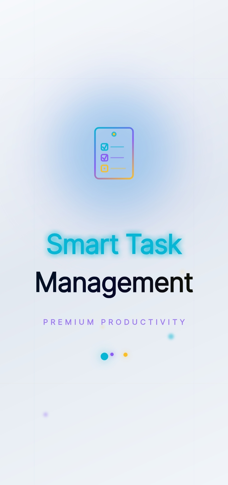
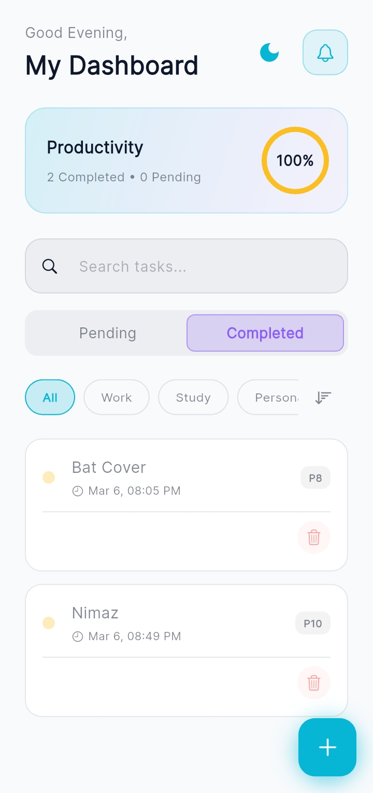
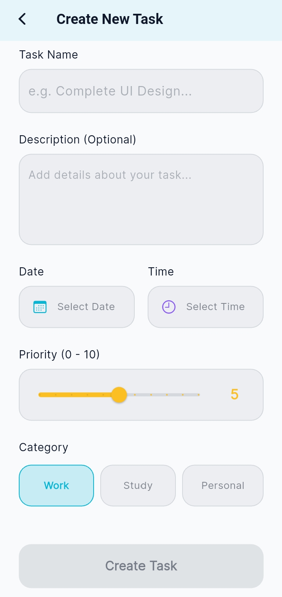
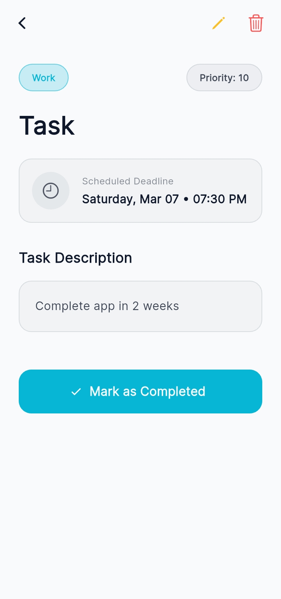
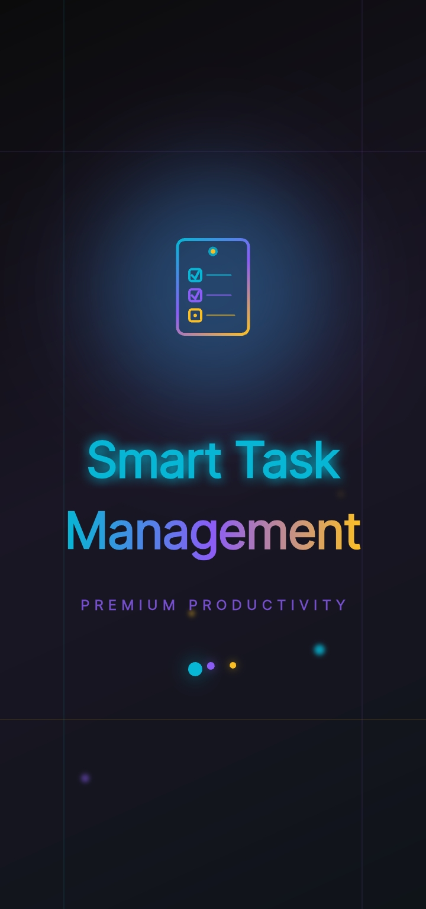
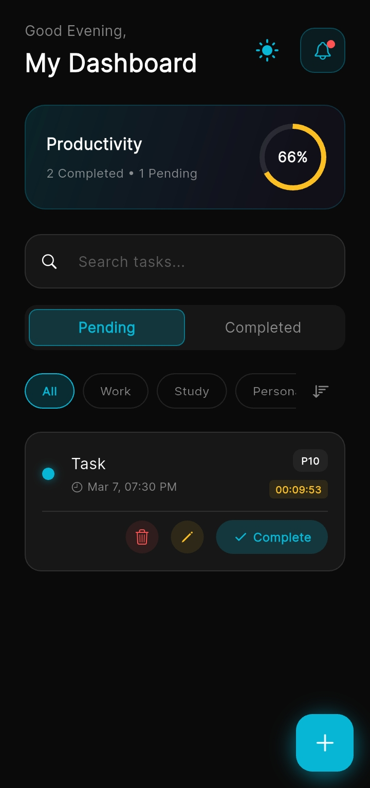
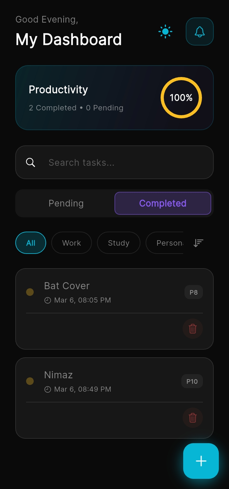
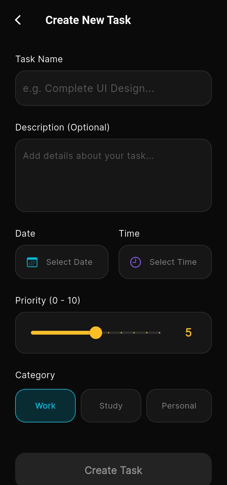
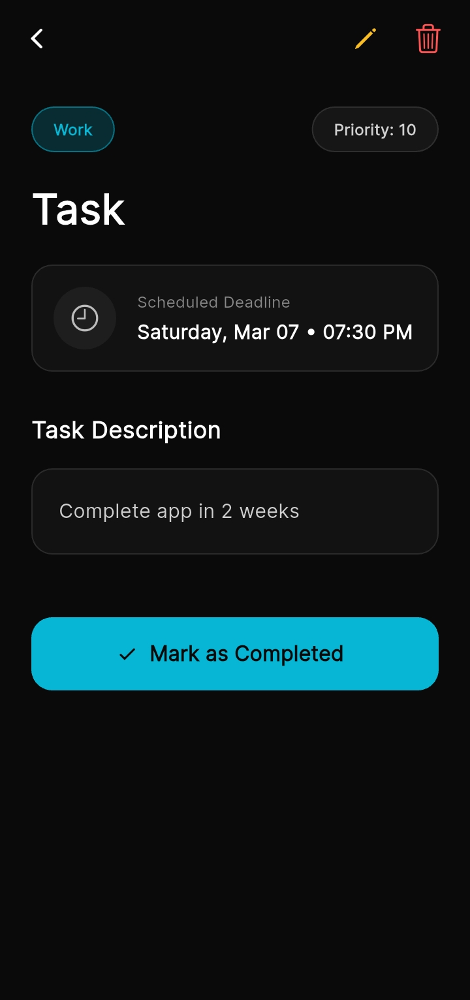

# Smart Task Manager (STM)

Smart Task Manager is a feature-rich, highly optimized Flutter application designed to boost productivity. It helps users organize their daily activities, track productivity percentages, and never miss a deadline with precise background alarms and notifications.

## 🚀 Key Features

* **Advanced Task Management:** Create, read, update, and delete (CRUD) tasks effortlessly.
* **Smart Categorization & Priority:** Organize tasks by categories (Work, Study, Personal) and assign priority levels (0-10).
* **Precise Background Alarms:** Utilizes `awesome_notifications` with `SCHEDULE_EXACT_ALARM` permissions to wake up the screen and ring exact alarms even when the app is completely terminated/killed.
* **Dynamic Productivity Dashboard:** Real-time calculation of pending vs. completed tasks with a visual circular progress indicator.
* **Persistent Theme Switching:** Seamlessly toggle between Light and Dark modes. The user's preference is saved locally and applied automatically on the next launch.
* **Pre-emptive Reminders:** Automated notification alerts at 24-hour, 10-hour, and 1-hour intervals before the actual deadline.

## 🛠️ Tech Stack & Architecture

* **Framework:** Flutter (Dart)
* **State Management:** Provider (MultiProvider architecture)
* **Local Database:** SQLite (`sqflite` package) for offline data persistence
* **Notifications & Alarms:** `awesome_notifications`
* **Local Storage:** `shared_preferences` for theme state management
* **Architecture:** Clean Architecture with separate modules for Dashboard, Task, Notification, and Core configuration.

## 📱 Screenshots
<p align="center">
  
  
  
  
  
  
  
  
  
</p>
## ⚙️ How to Run the App

1. Clone the repository:
   ```bash
   git clone [https://github.com/yourusername/smart-task-manager.git](https://github.com/yourusername/smart-task-manager.git)
2. Navigate to the project directory:

   ```bash
   cd smart-task-manager
3. Install dependencies:

   ```bash
   flutter pub get  
4. Run the app on an emulator or physical device:

   ```bash
   flutter run
Note: For the best experience with precise background alarms, test on a physical device and ensure you grant the required notification and alarm permissions on the first launch.

👤 Author:    
Tayyab Khan